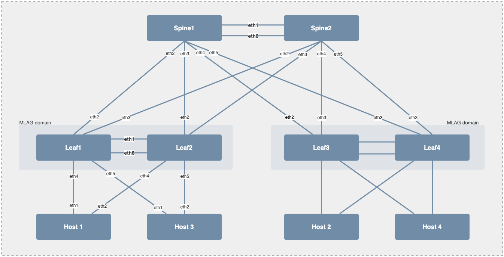

# Arista ATD Emulation on Containerlab

Basic EVPN/VXLAN setup based on [containerlab](https://containerlab.dev/) and [Arista AVD collection](https://www.avd.sh) to build configuration.

## Requirements

- Containerlab in version `>=0.50.0`
- Ansible
- Arista anta
- EOS Dowloader CLI

```bash
# Create a virtual-env
python3 -m venv .venv

# Activate virtual env
source .venv/bin/activate

# Install python requirements
pip install -r requirements.txt

# Install ansible requirements
ansible-galaxy collection install -r collections.yml --force
```

## Topology



- Deploy lab:

```bash
sudo containerlab deploy
```

You can access lab topology using SSH or your browser with `http://<IP of clab>/graphite`

- Save lab

```bash
sudo containerlab save
```

- Destroy lab

```bash
sudo containerlab destroy
```

## Configuration Management

__Inventory:__

- Inventory file: [atd-inventory/inventory.yml](atd-inventory/inventory.yml)
- AVD variables: [atd-inventory/group_vars](atd-inventory/group_vars)

__Commands__

- Build and deploy

```bash
ansible-playbook playbooks/atd-fabric-deploy.yml
```

- Build only

```bash
ansible-playbook playbooks/atd-fabric-deploy.yml --tags build
```

- Build & deploy via eAPI

```bash
ansible-playbook playbooks/atd-fabric-deploy.yml --tags build,deploy_eapi
```

- Build & deploy via CVP

> Be sure to update CVP information in your inventory file.

```bash
ansible-playbook playbooks/atd-fabric-deploy.yml --tags build,deploy_cvp
```

## Authentication

### Arista devices

- Username: __admin__ (password: _none_ no ssh access)
- Username: __arista__ (password: `arista`)

### Host devices

- Username: __root__ (password: `password123`)

## Management IPs

### Arista EOS containers

| Hostname | Management Interface | IP Address      |
| -------- | -------------------- | --------------  |
| Spine1   | Management0          | 192.168.0.10/24 |
| Spine2   | Management0          | 192.168.0.11/24 |
| Leaf1    | Management0          | 192.168.0.12/24 |
| Leaf2    | Management0          | 192.168.0.13/24 |
| Leaf3    | Management0          | 192.168.0.14/24 |
| Leaf4    | Management0          | 192.168.0.15/24 |

### Linux containers

| Hostname | Managemnt Interface | IP Address      |
| -------- | ------------------- | --------------  |
| Host1    | Eth0                | 192.168.0.16/24 |
| Host2    | Eth0                | 192.168.0.17/24 |
| Host3    | Eth0                | 192.168.0.18/24 |
| Host4    | Eth0                | 192.168.0.19/24 |

## Startup configuration

EOS devices configuration are saved under [atd-inventory/intended/configs](atd-inventory/intended/configs).
